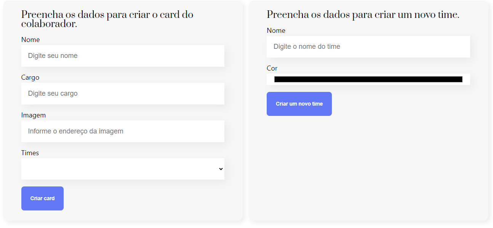
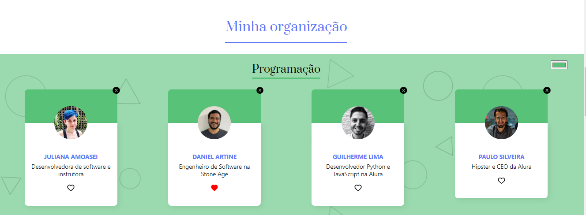

## Welcome! 👋

# Aconchego Residencial Sênior

This is my #2nd react project!

### Screen Shots
- Create and Add



### Screen Shots

- Favorite and Delete



## Some code that I'm proud of
```js
return (
    <div>
      <Banner />
      <Formulario
        cadastrarTime={cadastrarTime}
        times={times.map(time => time.nome)} 
        aoCadastrar={colaborador => setColaboradores([...colaboradores, colaborador])}
      />
      <section className="times">
        <h1>Minha organização</h1>
        {times.map((time, indice) => 
          <Time
            aoFavoritar={resolverFavorito}
            mudarCor={mudarCorDoTime} 
            key={indice} 
            time={time} 
            colaboradores={colaboradores.filter(colaborador => colaborador.time === time.nome)}
            aoDeletar={deletarColaborador} 
          />
        )}
      </section>
      <Rodape />
    </div>
  );
```

## Built with

- Semantic HTML5;
- CSS custom properties;
- JavaScript;

## Test the project yourself: [Teste the project here!!!](#)

### You can:

- Add members to the teams;
- Create and personalize new team;
- Change the existing teams colors;
- Delete members;
- Favorite members.

## Author

- Website - [My GitHub](https://github.com/lucasbailo)
- Frontend Mentor - [@lucasbailo](https://www.frontendmentor.io/profile/lucasbailo)
- Instagram - [@lucassbailo](https://www.instagram.com/lucassbailo/)
- LinkedIn - [Lucas Bailo](https://www.linkedin.com/in/lcsbailo)